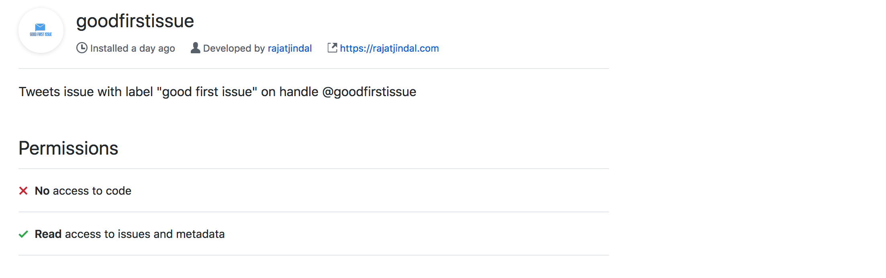

 

    

This is a [openfaas](https://www.openfaas.com) function, deployed on [openfaas-cloud](https://github.com/openfaas/openfaas-cloud) running on [Kubernetes](https://github.com/kubernetes/kubernetes), listening to webhook events from [goodfirstissue](https://github.com/apps/goodfirstissue) github app which configures a webhook for listening to `issues` github-event. 

It tweets the link to issue through [@goodfirstissue](https://twitter.com/goodfirstissue) `twitter` handle if:

- The issue has `good first issue` or `good-first-issue` label AND
- if action is one of `opened`, `reopened`, `labeled` or `unassigned`.

The target audience (or followers) for this twitter account are users who are looking forward for starting their journey in `open source contributions` and target audience for this app are github users/org who encourage `first time contributors` to make contributions to their repo(s).

# How to Install

- Go to https://github.com/apps/goodfirstissue
- Click on Configure
- Select the User/Org which owns the repo where you plan to install this app.
- Confirm Password (required by `github`). App don't get access to this password.
- Refer that only `read` access is required to `issues` and `metadata`.
- From `Repository Access` box, select the repositories where you want to enable it. You can enable for `all` or `only selected` repositories.
- Click Save and you are all set.

# Permissions required

The github app needs `read` access to `issues` and `metadata` of the repository. Refer to the screenshot below:

# Current users

Orgs/Users who have enabled `goodfirstissue` for all/selected repositories (generated using [github-app-installations](https://github.com/rajatjindal/github-app-installations))
&nbsp;
&nbsp;
&nbsp;
&nbsp;
&nbsp;
&nbsp;
&nbsp;
&nbsp;
&nbsp;
&nbsp;
&nbsp;
&nbsp;
&nbsp;
&nbsp;
&nbsp;
&nbsp;
&nbsp;
&nbsp;
&nbsp;
&nbsp;
* Connection #0 to host rajatjindal.o6s.io left intact
&nbsp;%

# Acknowledgements

Many thanks to [Alex Ellis](https://twitter.com/alexellisuk) for helping me write, build and deploy this openfaas-function to [openfaas-cloud](https://github.com/openfaas/openfaas-cloud).
